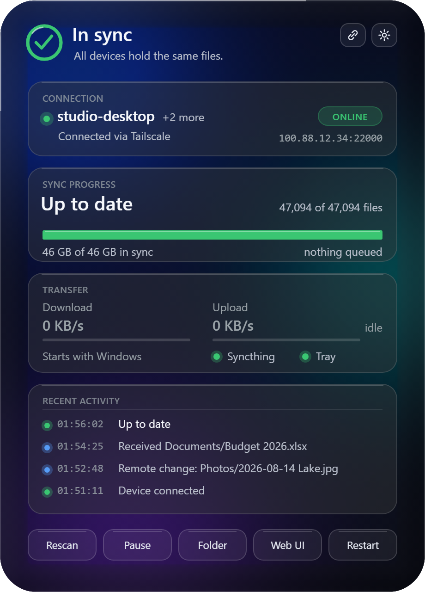
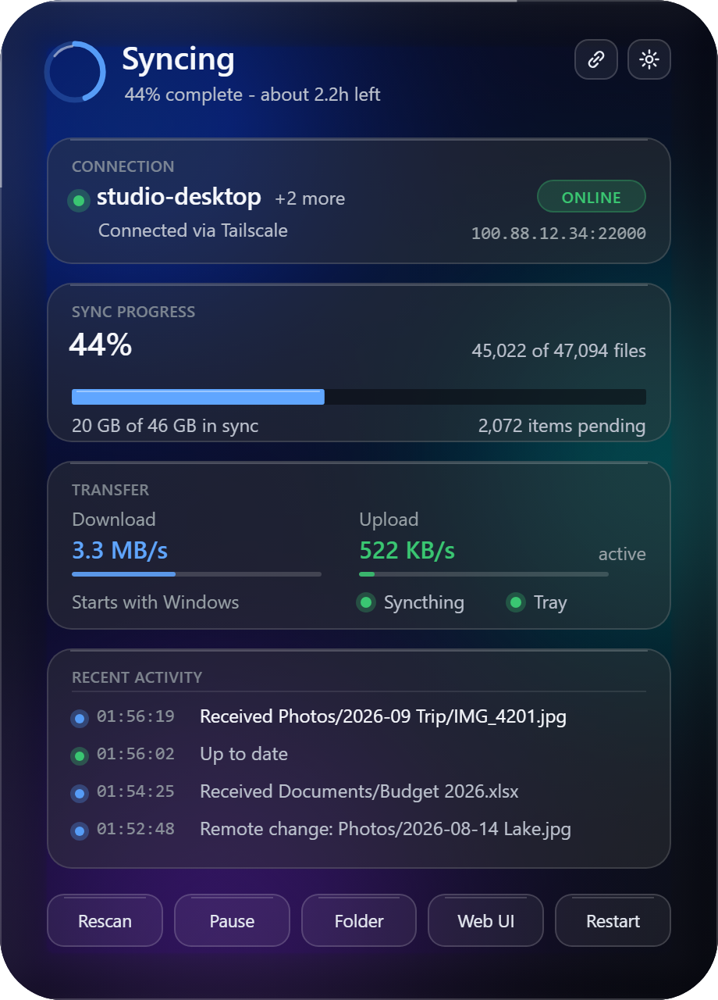
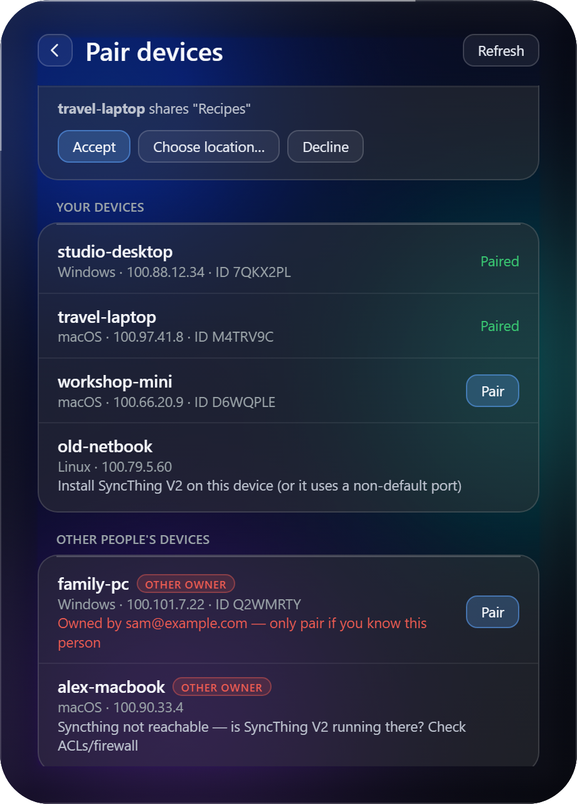
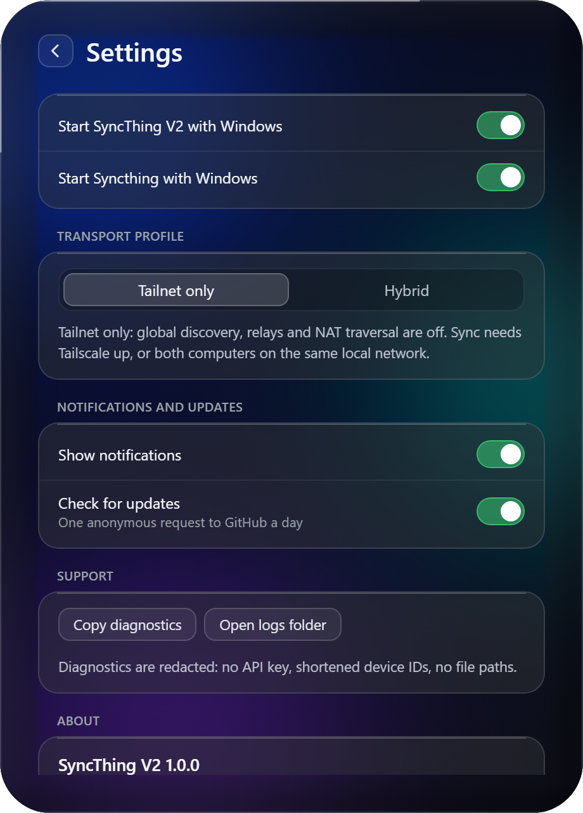
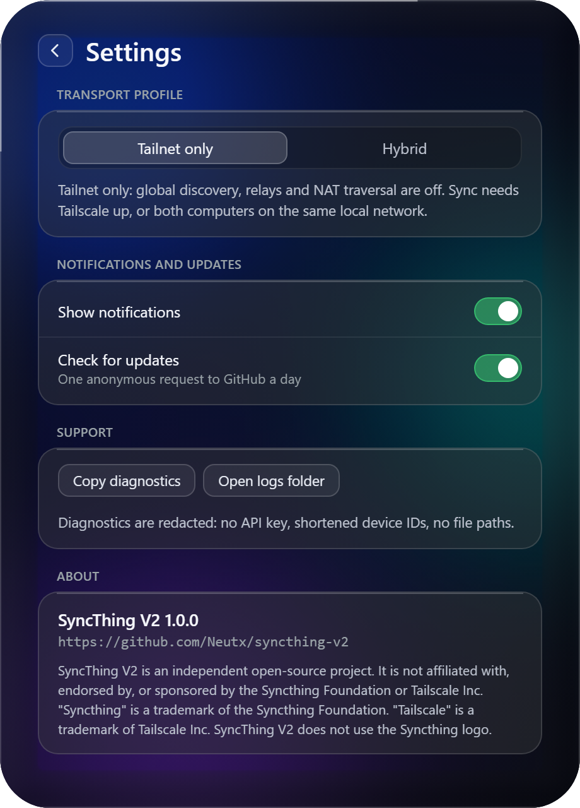

# SyncThing V2

A tray app that keeps [Syncthing](https://syncthing.net/) running and pairs your computers over [Tailscale](https://tailscale.com/). You never copy a device ID or type an IP address.

Install it on two computers that are signed in to the same Tailscale account, click **Pair** on one and **Accept** on the other, and pick a folder to share. SyncThing V2 then keeps an eye on the sync from the system tray. It shows a live status icon, notifications and a "Liquid Glass" dashboard.

<p align="center">
  
  
  
</p>

<p align="center">
  
  
</p>

<p align="center">
  
</p>

The screenshots come from demo mode (`stv2 demo`), which shows made-up devices, folders and activity.

## Quick start

1. **Install Tailscale on both computers** and sign in to the same account. See [docs/tailscale-setup.md](docs/tailscale-setup.md).
2. **Run the one-liner for your OS on both computers** (see below). SyncThing V2 installs for your user only. If Syncthing is missing, it downloads a verified copy and sets it up.
3. **Pair.** Open the dashboard from the tray icon on one computer, go to **Pair devices** and click **Pair** next to the other computer. On the other computer, click **Accept** in the notification or the dashboard. Then share a folder, and accept it on the other side.

### One-line install

**Windows** (PowerShell, no admin rights needed):

```powershell
[Net.ServicePointManager]::SecurityProtocol = [Net.ServicePointManager]::SecurityProtocol -bor 3072; irm https://github.com/Neutx/syncthing-v2/releases/latest/download/install.ps1 | iex
```

The first part turns on TLS 1.2, which Windows PowerShell 5.1 does not always offer to GitHub by default.

**macOS** and **Linux** (Terminal, no sudo):

```sh
curl -fsSL https://github.com/Neutx/syncthing-v2/releases/latest/download/install.sh | sh
```

Both scripts download the release for your platform, check it against `SHA256SUMS.txt` before running anything, and then run `stv2 install --yes`. To install from a downloaded file instead (`.exe`, `.dmg`, `.deb` or `.tar.gz`), see the guide for your OS:

- [Windows](docs/install-windows.md)
- [macOS](docs/install-macos.md)
- [Linux](docs/install-linux.md)

## Features

- **Pairing over Tailscale.** SyncThing V2 finds your other computers on the tailnet and reads their Syncthing device IDs directly from them. Both machines must agree with a click, and nothing is accepted automatically. Other people's devices on a shared tailnet get a clear warning. See [docs/pairing.md](docs/pairing.md).
- **Syncthing handled for you.** An existing Syncthing is adopted as it is. If there is none, SyncThing V2 downloads a pinned upstream release, checks its SHA-256, and sets it up to start at login. Syncthing's own auto-upgrade stays on.
- **Live tray status.** The ring icon shows in sync, syncing progress, checking, paused, disconnected (no paired device reachable), error, API key rejected and not running. The tooltip and menu show the folders, peers, transfer rates and time left.
- **Dashboard.** It has a status view with connection, sync progress, transfer and recent activity, plus the Pair view and Settings. On Windows it is a glass popup at the taskbar. On macOS and Linux it opens in your default browser.
- **Notifications** for disconnects, errors, returning to in sync, pairing requests, shared folders and updates. You can turn them off.
- **Secure by default.** SyncThing V2 opens no new network ports, and Syncthing's control panel stays on this computer. The dashboard server listens on loopback only and needs a single-use login token. No secrets are logged. See [docs/security.md](docs/security.md).
- **`stv2 doctor`** checks Tailscale, Syncthing, the tailnet and the firewall. Each finding has a code that links to [docs/troubleshooting.md](docs/troubleshooting.md).
- **Per-user install and clean uninstall.** No admin rights are needed. Uninstalling never touches Syncthing's settings, database or your synced files. See [docs/uninstall.md](docs/uninstall.md).

## Platform status

| Platform | Status | Package | Dashboard |
|---|---|---|---|
| Windows 10 1809+ and 11 (x64; Arm64 through emulation) | **Stable** | `SyncThingV2-Setup-<version>-windows-x64.exe`, PowerShell one-liner | Glass popup (WebView2); browser if WebView2 is missing |
| macOS 12+ (Apple silicon and Intel) | **Preview** | `.dmg`, `.tar.gz`, shell one-liner | Default browser |
| Linux x64 and arm64 (glibc or musl; X11 or Wayland) | **Preview** | `.deb`, `.tar.gz`, shell one-liner | Default browser |

"Preview" means CI builds and tests these platforms, but nobody has yet confirmed the tray and dashboard on real hardware. Reports are welcome in the [issue tracker](https://github.com/Neutx/syncthing-v2/issues).

## Verifying downloads

Every release has a `SHA256SUMS.txt` that covers all its assets, including both install scripts. The one-liners check it for you. To check a file you downloaded yourself:

```sh
# macOS / Linux (on macOS use: shasum -a 256 -c --ignore-missing SHA256SUMS.txt)
sha256sum -c --ignore-missing SHA256SUMS.txt
```

```powershell
# Windows: compare the output with the matching line of SHA256SUMS.txt
Get-FileHash .\SyncThingV2-Setup-1.0.0-windows-x64.exe -Algorithm SHA256
```

GitHub Actions builds every asset and signs it with a [build provenance attestation](https://docs.github.com/actions/security-for-github-actions/using-artifact-attestations). With the [GitHub CLI](https://cli.github.com/) you can check that a file came from this repository's release workflow:

```sh
gh attestation verify SyncThingV2-Setup-1.0.0-windows-x64.exe --repo Neutx/syncthing-v2
```

Release 1.0 binaries are not code-signed. Windows SmartScreen and macOS Gatekeeper ask for confirmation, as described in the install guides.

## Documentation

- Install: [Windows](docs/install-windows.md), [macOS](docs/install-macos.md), [Linux](docs/install-linux.md), [uninstall](docs/uninstall.md), [moving from a manual Syncthing setup](docs/migrating-from-manual-setup.md)
- Using it: [Tailscale setup](docs/tailscale-setup.md), [pairing](docs/pairing.md), [troubleshooting](docs/troubleshooting.md)
- How it works: [architecture](docs/architecture.md), [security](docs/security.md), [dashboard design](docs/design.md)
- Development: [building](docs/building.md), [releasing](docs/releasing.md), [contributing](CONTRIBUTING.md), [reporting a vulnerability](SECURITY.md), [changelog](CHANGELOG.md)

## Licence

SyncThing V2 is released under the [MIT licence](LICENSE). Third-party components and their licences are listed in [THIRD_PARTY_NOTICES.md](THIRD_PARTY_NOTICES.md). Syncthing itself is not bundled. When it is missing, SyncThing V2 downloads it from the official Syncthing releases. Syncthing is licensed under the MPL-2.0.

---

SyncThing V2 is an independent open-source project. It is not affiliated with, endorsed by, or sponsored by the Syncthing Foundation or Tailscale Inc. "Syncthing" is a trademark of the Syncthing Foundation. "Tailscale" is a trademark of Tailscale Inc. SyncThing V2 does not use the Syncthing logo.
